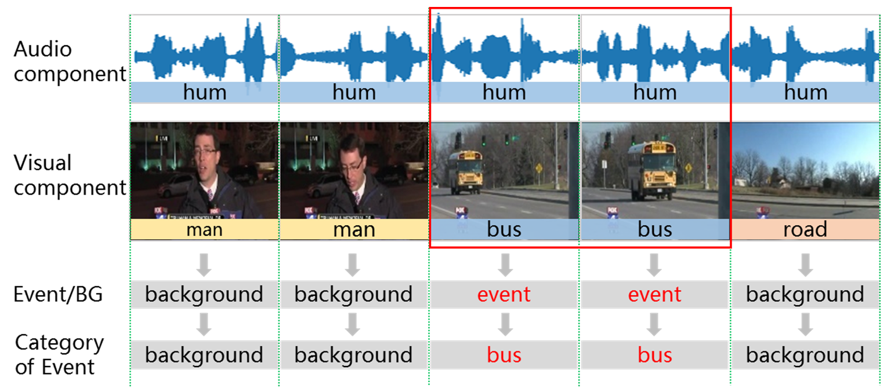
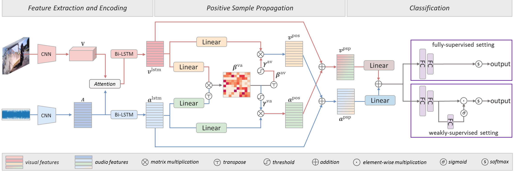

## Pytorch implementation for the CVPR-2021 paper: **Positive Sample Propagation along the Audio-Visual Event Line**

### paper link: [https://arxiv.org/abs/2104.00239](https://arxiv.org/abs/2104.00239)

## Audio-Visual Event (AVE) Localization task
---
AVE localization aims to find out those video segments containing an *audio-visual event* and classify its category.
An *audio-visual* event is both audible and visible, which means the sound source must appear in visual image (visible) while the sound it makes also exists in audio portion (audible).

## Our Framework

## Data preparation
---
The AVE dataset and the extracted audio and visual features can be downloaded from [https://github.com/YapengTian/AVE-ECCV18](https://github.com/YapengTian/AVE-ECCV18).
Other preprocessed files used in this repository can be downloaded from [here](https://drive.google.com/file/d/1juKwV813ZibgX79VDjB6X6Pnmq1X7Huz/view?usp=sharing).
All the data needed is listed as below, and these files should be included in the ``data`` folder.
<pre><code>
audio_feature.h5  visual_feature.h5  audio_feature_noisy.h5 visual_feature_noisy.h5
right_label.h5  prob_label.h5  labels_noisy.h5  mil_labels.h5
train_order.h5  val_order.h5  test_order.h5
</code></pre>

## Fully supervised setting
- Train:
>  CUDA_VISIBLE_DEVICES=0 python fully_supervised_main.py --model_name PSP --threshold=0.099 --train
- Test:
>  CUDA_VISIBLE_DEVICES=0 python fully_supervised_main.py --model_name PSP --threshold=0.099 --trained_model_path ./model/PSP_fully.pt

## Weakly supervised setting
- Train:
> CUDA_VISIBLE_DEVICES=0 python weakly_supervised_main.py --model_name PSP --threshold=0.095 --train
- Test:
> CUDA_VISIBLE_DEVICES=0 python weakly_supervised_main.py --model_name PSP --threshold=0.095 --trained_model_path ./model/PSP_weakly.pt

**Note:** The pre-trained model can be downloaded [here](https://drive.google.com/drive/folders/1YEyEH6e988v1NUwwVYohrwY2DSpVtVoT?usp=sharing) and it should be placed into the ``model`` folder. With the pre-trained model, the AVE localization accuracy can achieve 78.0% and 73.9% under the fully and weakly supervised settings, respectively. This result is slightly higher than that we reported in the arxiv paper (77.8% and 73.5%). If you would like to train from scratch for the both settings, you may adjust the threshold value or initialization method to further improve performance.

## Citation
----
If our paper is useful for your research, please consider citing it:
<pre><code>@InProceedings{zhou2021positive,
    title={Positive Sample Propagation along the Audio-Visual Event Line},
    author={Zhou, Jinxing and Zheng, Liang and Zhong, Yiran and Hao, Shijie and Wang, Meng},
    booktitle = {Proceedings of the IEEE Conference on Computer Vision and Pattern Recognition (CVPR)},
    year={2021},
}
</code></pre>

## Acknowledgements
This code began with [YapengTian/AVE-ECCV18](https://github.com/YapengTian/AVE-ECCV18). Thanks for their great work.
We also hope our source code can help people who are interested in our work or the audio-visual related problems.
If you have any questions about our paper or the codes, please feel free to open an issue or contact us by email.
